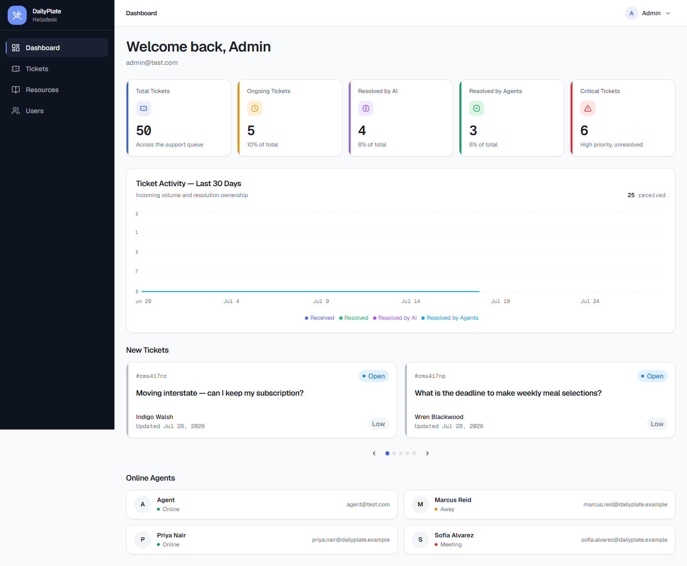
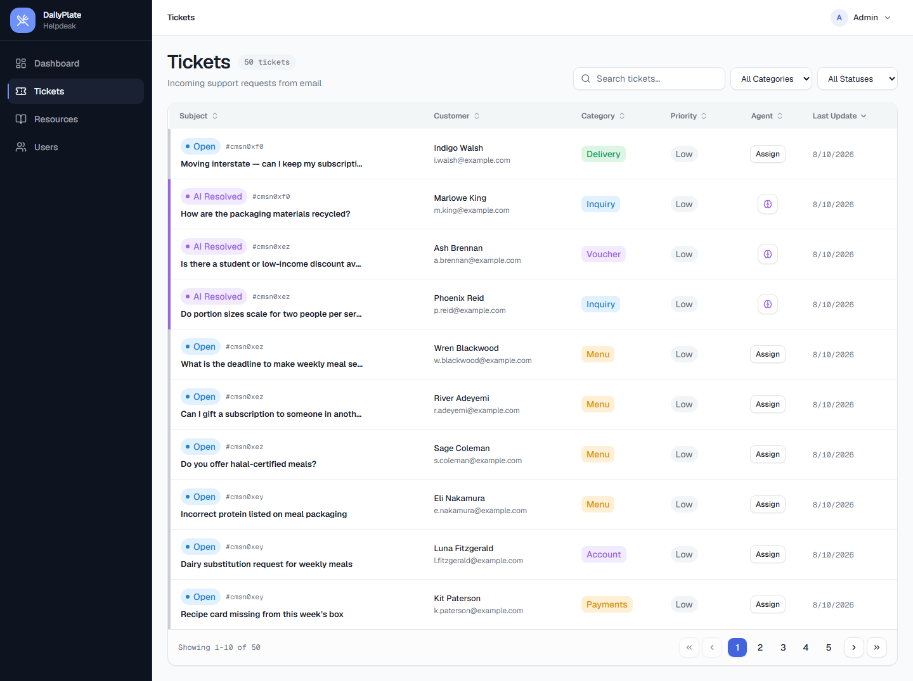
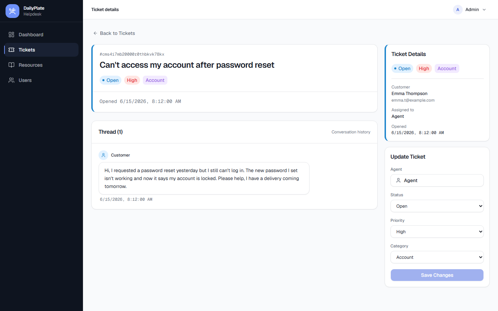
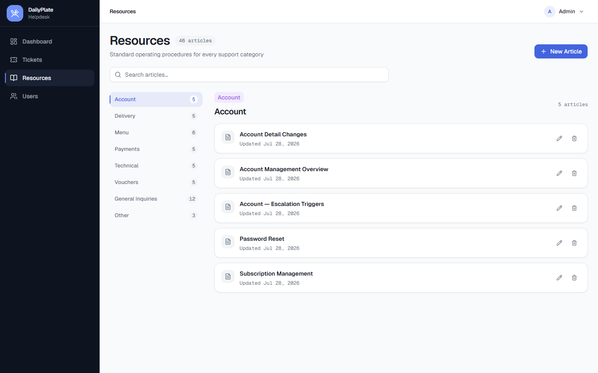
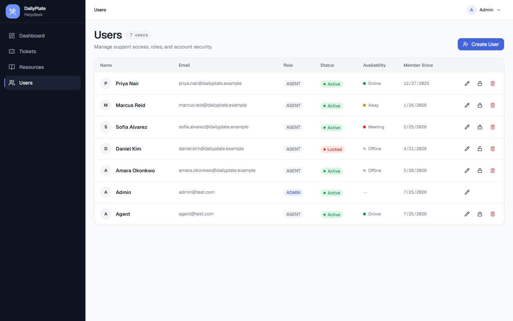
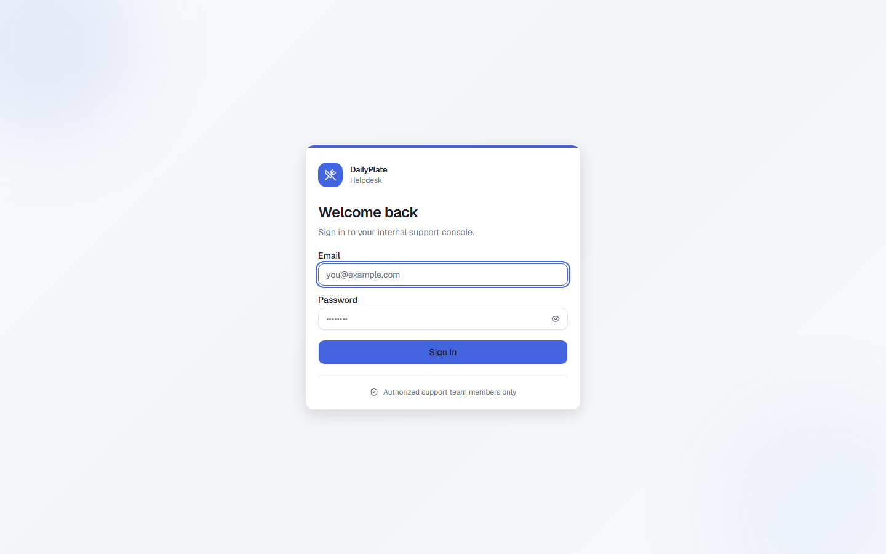

# DailyPlate Helpdesk — AI-Powered Support Ticketing

A full-stack customer-support helpdesk that turns inbound emails into tickets, uses AI to
classify and (where safe) auto-resolve them, and routes everything else to human agents with
an AI reply assistant at their side.

> **Why it exists:** Traditional email helpdesks are slow at high volume and lean on canned
> replies that feel impersonal. DailyPlate lets AI instantly handle the easy, policy-only
> questions while making sure anything account-specific or sensitive reaches a real agent —
> with the whole conversation kept inside one email thread.

[](https://github.com/JamesRavenT/dailyplate-helpdesk/actions/workflows/ci.yml)

**Status:** v1.1.0 — actively developed portfolio project. Not affiliated with any real brand.

---

## Table of contents

- [The problem](#the-problem)
- [The solution](#the-solution)
- [Features](#features)
- [How it works](#how-it-works)
- [Tech stack](#tech-stack)
- [Architecture](#architecture)
- [Project structure](#project-structure)
- [Local development](#local-development)
- [Testing](#testing)
- [Deployment](#deployment)
- [Screenshots](#screenshots)
- [Security](#security)
- [Limitations](#limitations)
- [Documentation](#documentation)
- [License](#license)

---

## The problem

Email support queues don't scale gracefully. As volume grows, response times slip, easy
"what's your refund policy?" questions sit in the same queue as urgent account problems, and
teams reach for canned macros that read as impersonal. The cost of triage — reading, categorizing,
prioritizing, and routing every message — falls entirely on people.

## The solution

DailyPlate puts an AI triage layer in front of the human queue:

- Every inbound email becomes a ticket automatically.
- AI classifies it (category + priority) and decides whether it can be answered with
  **general, policy-only** information.
- If yes, the AI writes a personalized reply in the same email thread and marks the ticket
  resolved — **without ever claiming to take account-specific actions**.
- If no, the ticket is round-robin routed to an available agent, who gets an AI "Polish"
  assistant and one-click thread summaries to work faster.

The result: humans spend their time on the tickets that actually need a human.

---

## Features

### AI ticket automation
- **Email-to-ticket** — inbound emails become tickets via a signature-verified inbound pipeline.
  Replies in an existing thread are appended to the matching ticket (matched on the email
  `In-Reply-To` / `References` headers).
- **AI classification** — every new ticket is classified by **category** and **priority**.
- **AI auto-resolution** — for policy-only questions (how-to, pricing tiers, refund/cancellation
  *policy*, voucher instructions), the AI writes and sends a complete, personalized reply in the
  same thread and marks the ticket `AI_RESOLVED`. It is explicitly constrained to **never** claim
  to take account-specific actions (no refunds, password resets, or lookups).
- **Smart human routing** — anything requiring account access or judgment is routed to an agent.
- **Auto-reopen** — a customer reply to an AI-resolved ticket reopens it to `OPEN` and re-queues it.
- **Async processing** — AI work runs off the request path on a **pg-boss** job queue, so
  webhook responses stay fast, with automatic retries for failed jobs.

### Agent workflow
- **Round-robin assignment** — load-aware distribution across `ONLINE` agents, capped at
  5 concurrent open tickets per agent; overflow waits in a queue.
- **Agent presence** — agents set their status (Online / Away / Meeting / Offline); going online
  or away drains queued tickets to them. A background sweep marks stale agents offline.
- **Threaded replies** — agent replies are emailed to the customer inside the original thread.
- **AI "Polish" assistant** — one click rewrites an agent's draft for clarity, tone, and grammar
  while preserving intent.
- **AI ticket summary** — a concise 2–4 sentence summary of a thread so agents get up to speed fast.
- **Ticket list** — server-side search, category/status filtering, sorting, and pagination;
  agents see only their assigned tickets, admins see everything.
- **Ticket detail** — full conversation thread, reply composer with draft persistence, and an
  update panel for status, priority, category, and assignment.

### Admin
- **Dashboard** — a 30-day activity chart plus stat tiles. Admins see received vs. resolved
  (split by AI vs. agents) and critical/ongoing counts; agents get a personal view. Includes a
  new-tickets slideshow and an online-agents panel.
- **User management** — create, edit, lock/unlock, and delete agent accounts. Destructive actions
  (delete / lock) require the admin to re-enter their own password; locking also revokes the
  target's active sessions.
- **Knowledge base** — category-organized SOP articles that ground the AI's replies.

### Platform
- **Role-based access** — `ADMIN` and `AGENT` roles protect business-data routes; agents are
  further scoped to their own tickets in the controllers.
- **Professional UI** — a cohesive design system: dark sidebar app shell, a semantic
  status/priority color language, Geist + Geist Mono typography, and consistent loading/empty/
  error states throughout.
- **Error monitoring** — Sentry on both backend and frontend (no-ops when no DSN is set).

---

## How it works

```
Customer email
      │
      ▼
Resend Inbound ──(signed webhook)──► n8n gateway (GCP VM)
                                        │  verifies Svix signature, forwards
                                        ▼
                          POST /api/internal/resend-inbound  (token-authed, on Render)
                                        │
                                        ▼
                               Create / update Ticket ──► pg-boss queue
                                                               │
                                               ┌───────────────┴────────────────┐
                                               ▼                                 ▼
                                  AI: classify + can resolve?             (queued job, automatic retries)
                                               │
                    ┌──────────────────────────┴──────────────────────────┐
                    ▼ yes (policy-only)                                     ▼ no
           AI writes reply → email in-thread                     Round-robin → assign agent
           status = AI_RESOLVED                                   status = OPEN
                    │                                                       │
        customer replies? → reopen (OPEN)                     agent replies / resolves / closes
```

The ticket status flow: `AI_PROCESSING → AI_RESOLVED` (auto) **or** `→ OPEN → IN_PROGRESS →
RESOLVED → CLOSED` (human). A customer reply to an `AI_RESOLVED` ticket sends it back to `OPEN`.

See [docs/explanation/architecture.md](./docs/explanation/architecture.md) for the full design
discussion, including why the inbound pipeline is split between n8n and the Render backend.

---

## Tech stack

| Layer | Technology |
|---|---|
| **Frontend** | React 18, TypeScript, Vite 6 |
| **UI / design system** | Tailwind CSS v4, shadcn/ui (base-nova) on `@base-ui/react`, lucide-react, Recharts, Geist + Geist Mono |
| **Data fetching** | TanStack Query, TanStack Table, Axios |
| **Forms / validation** | React Hook Form + Zod |
| **Routing** | React Router v6 |
| **Backend** | Express 4 on the **Bun** runtime, TypeScript |
| **Auth** | [Better Auth](https://www.better-auth.com/) — email/password, DB sessions, custom roles |
| **ORM / DB** | Prisma 7 (driver adapter `@prisma/adapter-pg`) + PostgreSQL 16 (**Neon** in production) |
| **Job queue** | pg-boss (Postgres-backed) |
| **AI** | Vercel AI SDK (`ai`, `@ai-sdk/openai`) with OpenAI **gpt-4.1-nano** (`generateObject` for classification, `generateText` for polish/summary) |
| **Email** | Resend — outbound replies + inbound email fetch |
| **Automation** | n8n — inbound webhook gateway (Svix verification + forwarding) |
| **Validation / security** | Zod, Helmet, CORS, express-rate-limit |
| **Monitoring** | Sentry (`@sentry/node`, `@sentry/react`) |
| **Testing** | Bun (backend units), Vitest + React Testing Library (component), Playwright + Allure (E2E), playwright-bdd (Gherkin) |
| **Hosting** | Cloudflare Workers (SPA + API proxy), Render (backend, Docker), Neon (database), n8n on a GCP VM |
| **CI/CD** | GitHub Actions — PR gates, commit-aware deploy verification, staging promotion gate, branch protection |

---

## Architecture

```
                         ┌─────────────────────────────────────────┐
   Browser ──────────────►  Cloudflare Worker  (one origin)         │
                         │    ├─ /*              → built SPA assets  │
                         │    ├─ /api/*, /health → reverse-proxy ────┼──► Render
                         │    └─ /api/internal/* → blocked (404)     │     (Express + pg-boss
                         └─────────────────────────────────────────┘      + Better Auth + AI)
                                                                                │
   Resend inbound ──► n8n gateway (GCP VM) ──► POST /api/internal/* ────────────┘
                                                                                │
                                                                                ▼
                                                                          Neon Postgres
```

- **One origin to the browser.** The Cloudflare Worker serves the built SPA from the edge and
  reverse-proxies `/api/*` and `/health` to the Render backend, passing `Set-Cookie` through
  unchanged. This keeps Better Auth session cookies first-party and avoids CORS. Internal
  service endpoints (`/api/internal/*`) are blocked at the edge.
- **Backend** is a thin Express app on Bun: routes → controllers → Prisma. Better Auth mounts at
  `/api/auth/*` (before `express.json`). Inbound AI work is enqueued to pg-boss and handled by a
  worker so HTTP requests return immediately.
- **Database** is Neon (serverless Postgres). Prisma runtime and pg-boss use the **pooled**
  connection; the Prisma CLI (migrations) uses the **direct** connection.
- **Inbound email** flows through an **n8n** workflow on a GCP VM that verifies the Resend/Svix
  signature and forwards the event to a token-authenticated internal endpoint on Render, which
  runs the existing thread-matching + triage pipeline. This offloads the webhook front door and
  adds retry/observability while keeping all business logic in tested TypeScript.
- **Auth** is database-session based (no JWTs). Sessions live in the Postgres `session` table with
  a 1-hour expiry, and agents are signed out after 60 minutes of inactivity. **Sign-up is
  disabled** — the first admin is seeded; further users are created by admins from the UI.

---

## Project structure

```
helpdesk/
├── docker-compose.yml       # Local dev: postgres + backend + frontend + test db
├── docs/                    # Diátaxis docs (how-to, explanation, reference) + assets
├── render.yaml              # Render Blueprint: Docker web service, health check, env vars
├── backend/
│   ├── Dockerfile.prod      # Production backend image (Render)
│   ├── docker-entrypoint.sh # migrate deploy → start (free plan has no pre-deploy hook)
│   ├── src/
│   │   ├── index.ts         # App entry (middleware, routes, boss startup)
│   │   ├── instrument.ts    # dotenv + Sentry init (imported first)
│   │   ├── controllers/     # tickets, users, articles, webhooks, internal
│   │   ├── routes/          # route definitions (incl. internal router)
│   │   ├── middleware/      # requireAuth / requireAdmin, internal token, error handler
│   │   └── lib/             # auth, prisma, triage (queue + AI), email
│   └── prisma/
│       ├── schema.prisma
│       ├── migrations/      # committed migration history
│       └── seed.ts          # creates the initial admin
├── frontend/
│   ├── wrangler.jsonc       # Cloudflare Worker config (static assets + /api proxy)
│   ├── worker/              # Worker: serves SPA + reverse-proxies the API
│   └── src/
│       ├── pages/           # Login, Home (dashboard), Tickets, TicketDetail, Users, Resources
│       ├── components/      # layout/AppShell, route guards, dialogs, ui/ design primitives
│       ├── lib/             # auth-client, utils
│       └── instrument.ts    # Sentry init (imported first)
├── e2e/                     # Playwright E2E + Allure reporting
└── n8n/                     # Inbound-gateway workflow export + setup guide
```

### Routes

| Path | Page | Access |
|---|---|---|
| `/login` | Login | Public |
| `/` | Dashboard | Authenticated |
| `/tickets` | Ticket list | Authenticated |
| `/tickets/:id` | Ticket detail | Authenticated (agents: own tickets) |
| `/resources` | Knowledge base | Authenticated |
| `/users` | User management | Admin only |

---

## Local development

### Prerequisites
- [Bun](https://bun.sh) v1.x
- [Node.js](https://nodejs.org) v20.x (for the frontend and E2E tooling)
- [Docker Desktop](https://www.docker.com/products/docker-desktop) (for PostgreSQL)

### 1. Install dependencies
```bash
cd backend  && bun install && cd ..
cd frontend && npm install && cd ..
cd e2e      && npm install && cd ..
```

### 2. Configure environment
```bash
cp backend/.env.example backend/.env
# Fill in: BETTER_AUTH_SECRET, OPENAI_API_KEY, RESEND_*, SEED_ADMIN_*, INTERNAL_API_TOKEN
```
This copy is required before any `docker compose up` command, including starting only
PostgreSQL, because Compose validates the backend service's environment file when it loads
the project. See `backend/.env.example` for the full annotated list.

### 3. Start PostgreSQL
```bash
docker compose up postgres -d      # exposes localhost:5433
```

### 4. Migrate + seed the admin
```bash
cd backend
bun run prisma:deploy   # apply migrations
bun run prisma:seed     # create the SEED_ADMIN_* account
```

### 5. Run the apps
```bash
# terminal 1
cd backend  && bun run dev     # http://localhost:3001
# terminal 2
cd frontend && npm run dev     # http://localhost:5173
```
The frontend proxies `/api` and `/health` to the backend, so there are no CORS issues in dev.
Log in at `/login` with your `SEED_ADMIN_*` credentials.

---

## Testing

```bash
# Backend unit tests (bun) — 56 tests
cd backend && bun test

# Component tests (Vitest + React Testing Library) — 186 tests
cd frontend && npm run test:component     # CI run
cd frontend && npm run test:watch         # watch mode

# E2E tests (Playwright) — needs the test database
docker compose up postgres-test -d
cd e2e && npm test
cd e2e && npm run report                  # generate + open the Allure report

# BDD scenarios (playwright-bdd) — compiled from docs/reference/features/
cd e2e && npm run test:bdd
cd e2e && npm run test:bdd:critical       # also :smoke, :security
```

The default E2E suite uses a deterministic, network-free AI stub. Live OpenAI triage validation
is a separate opt-in project that requires a real key and incurs API cost; see the
[testing strategy](./docs/explanation/testing-strategy.md#real-openai-validation-opt-in-and-paid).

**Test layering:** UI logic is covered by fast component tests; E2E is reserved for what needs
the real backend (webhook → DB → API → UI pipelines, backend-enforced authorization, real
mutations). Full strategy in [docs/explanation/testing-strategy.md](./docs/explanation/testing-strategy.md).

**BDD:** business-readable Gherkin lives in [docs/reference/features/](./docs/reference/features/)
as the living specification. `playwright-bdd` compiles it into Playwright specs, so it reuses the
existing runner, fixtures and Allure pipeline rather than adding a parallel one. Scenarios tagged
`@gap`, `@manual` or `@accepted-risk` are specification only and never execute. Risk register and
release assessment in [docs/explanation/release-test-plan.md](./docs/explanation/release-test-plan.md).

---

## Deployment

Production runs across three managed services plus one self-hosted automation node:

- **Cloudflare Workers** — serves the built SPA and reverse-proxies the API (one origin).
- **Render** — the Express + pg-boss backend, built from `backend/Dockerfile.prod` via the
  [`render.yaml`](./render.yaml) Blueprint. Migrations run at container start.
- **Neon** — serverless PostgreSQL.
- **n8n** (GCP VM) — the inbound email gateway.

Full step-by-step instructions, the environment-variable reference, and the n8n workflow setup
are in **[docs/how-to/deploy.md](./docs/how-to/deploy.md)**.

### Environments and CI/CD

Two deployed environments, fed by two branches:

| Branch | Environment | Database |
|---|---|---|
| `develop` | staging — `staging.dailyplate.help` | its own Neon project |
| `main` | production — `dailyplate.help` | Neon production |

Cloudflare and Render build each branch themselves, so GitHub Actions tests, verifies, and decides
what may be released — it never deploys:

- **`ci.yml`** — every pull request runs the backend unit tests and typecheck, the component tests
  and production build, and a migration drift check that fails if `schema.prisma` changed without a
  matching migration. The full Playwright suite gates `develop` and `main`, or any PR labelled
  `run-e2e`.
- **`deploy-smoke.yml`** — waits for the deployed `/health` to report the **triggering commit**,
  not merely a `200`, then runs the smoke project. Targets are asymmetric by design: `develop`
  verifies staging with the full suite *including an authenticated sign-in*, while `main` runs a
  **read-only canary** with no credentials supplied — so no admin credential for the live system
  exists in CI.
- **`promote.yml`** — the release gate. It refuses to fast-forward `main` unless CI, the staging
  smoke suite, and the staging frontend build all concluded successfully **for that exact commit**.
  Branch protection requires the same checks, so the rule holds even without the workflow.

Staging deliberately carries **no third-party credentials**: `ALLOW_STUB_AI` selects a
deterministic AI stub and `EMAIL_DELIVERY_ENABLED=false` disables outbound mail, while
`NODE_ENV=production` keeps every security guard active. Nothing in staging can spend money or
email a real person, and the inbound email pipeline (Resend → n8n) points only at production.

---

## Screenshots

Captured from the running app against seeded demo data (see [`docs/assets/`](./docs/assets/)).

**Admin dashboard** — activity chart, live stats, new-ticket carousel, online agents.



**Ticket queue** — sortable, filterable, searchable; status / priority / category and AI-vs-agent ownership at a glance.



**Ticket detail** — full email thread, customer context, and the agent update panel.



<details>
<summary>More screens — knowledge base, user management, sign-in</summary>

**Knowledge base** — category-organized SOP articles that ground the AI's replies.



**User management** — roles, active/locked status, and agent availability.



**Sign-in** — email/password only; sign-up is disabled by design.



</details>

---

## Security

- **Authentication & roles** — Better Auth with DB sessions; `requireAuth` / `requireAdmin` on
  every protected business-data route, with agents scoped to their own tickets at controller
  level. Health, the API root, Better Auth, the development-only legacy webhook, and internal
  service routes use their own boundaries.
- **Input validation** — Zod schemas on all request bodies and query params.
- **SQL safety** — Prisma everywhere; raw analytics queries use parameterized tagged templates.
- **Inbound integrity** — the Resend/Svix signature is verified in the n8n gateway; the internal
  endpoint it calls is protected by a timing-safe shared-token check and is blocked at the
  Cloudflare edge. The legacy shared-secret webhook is disabled in production.
- **Admin re-auth** — deleting or locking a user requires the admin's password; locking also
  revokes the target's sessions.
- **Hardening** — Helmet headers, locked-down CORS, a global API rate limiter plus stricter
  sign-in and internal-endpoint limiters, a body-size cap, generic error responses (no
  stack-trace leakage), and `trust proxy` for correct client-IP handling behind the proxy chain.

> Secrets are provided via environment variables and are never committed. Rotate any keys before
> deploying to production — see the checklist in [docs/how-to/deploy.md](./docs/how-to/deploy.md).

---

## Limitations

- **Single-region, single-instance backend.** The Render service and its pg-boss worker run as
  one instance; there is no horizontal scaling or high-availability failover.
- **Free-tier cold starts.** On Render's free plan the backend spins down after ~15 minutes of
  inactivity and takes ~30–60s to wake, and its in-process pg-boss workers (AI triage, the
  agent-presence sweep) are paused while it sleeps. A paid instance type removes both.
- **n8n is a single self-hosted node.** The inbound gateway runs on one free-tier GCP VM — an
  acceptable single point of failure for a portfolio, not production-grade HA. Resend's delivery
  retries (~24h) and n8n's execution retries mitigate short outages.
- **Database never fully idles.** A per-minute agent-presence sweep keeps Neon's compute awake,
  so scale-to-zero savings don't apply while the backend is running.
- **AI auto-resolution is deliberately conservative.** It only answers policy-only questions and
  never performs account actions, so some answerable-but-account-specific tickets still go to a
  human.
- **English-only** classification and replies; no multi-language handling.
- **Staging has no email pipeline.** Resend inbound and the n8n gateway point only at production,
  so the inbound email hop is rehearsed by the E2E suite against the real webhook rather than on
  staging. Duplicating it would need a second inbound address and a second n8n workflow.
- **Frontend deploys are build-verified, not commit-verified.** `/health` reports the running
  backend commit, but the Worker exposes no equivalent, so the smoke suite proves the frontend
  *built* for a commit rather than that the edge is serving it.

---

## Documentation

| Doc | Type | What it covers |
|---|---|---|
| [docs/tutorial/getting-started.md](./docs/tutorial/getting-started.md) | Tutorial | Running the app locally and working a seeded ticket |
| [docs/how-to/deploy.md](./docs/how-to/deploy.md) | How-to | Deploying to Cloudflare + Render + Neon + n8n |
| [docs/explanation/architecture.md](./docs/explanation/architecture.md) | Explanation | System design and the key decisions behind it |
| [docs/explanation/testing-strategy.md](./docs/explanation/testing-strategy.md) | Explanation | The component-vs-E2E testing layers |
| [docs/explanation/release-test-plan.md](./docs/explanation/release-test-plan.md) | Explanation | Risk register, BDD framework decision, release assessment |
| [docs/reference/features/](./docs/reference/features/) | Reference | Gherkin living specification |
| [docs/reference/api.md](./docs/reference/api.md) | Reference | Backend endpoints and their auth boundaries |
| [docs/reference/environment-variables.md](./docs/reference/environment-variables.md) | Reference | Every environment variable |
| [LICENSE](./LICENSE) | License | MIT license terms |

---

## License

DailyPlate Helpdesk is available under the [MIT License](./LICENSE).
